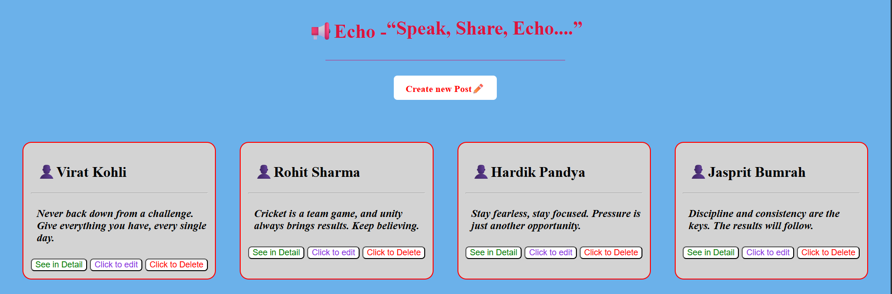
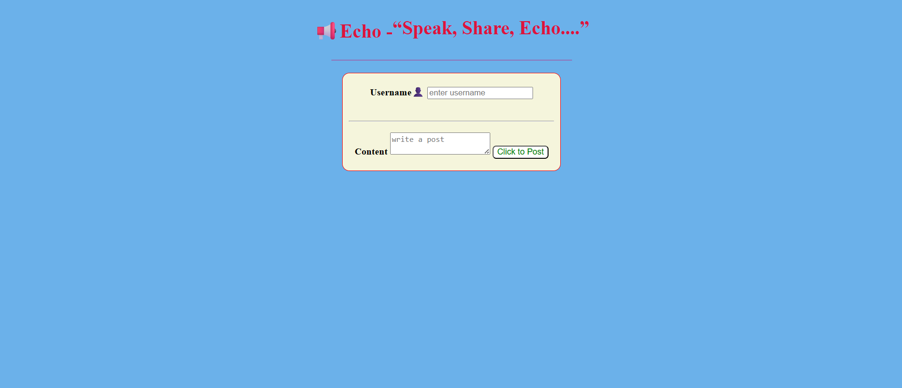

# 📮 POST it Status App

A simple web application built using **Express.js**, **EJS**, and **MongoDB** where users can create, view, update, and delete posts.

---

## 🖼️ Screenshots




---

## 🚀 Features

- Create a new post  
- View all posts  
- Edit/Update an existing post  
- Delete a post  
- MongoDB as database for storing posts  
- EJS as templating engine for rendering dynamic pages  

---

## 🛠️ Tech Stack

- **Backend:** Node.js, Express.js  
- **Frontend:** EJS (Embedded JavaScript templates), CSS  
- **Database:** MongoDB  

---

## 📂 Project Structure

```
POST-APP/
│
├── models/           # MongoDB models (Post schema)
│   └── Post.js
│
├── routes/           # Express routes
│   └── postRoutes.js
│
├── views/            # EJS templates
│   ├── index.ejs
│   ├── new.ejs
│   ├── edit.ejs
│   └── layout.ejs
│
├── public/           # Static files (CSS, JS, images)
│   └── style.css
│
├── app.js            # Main server file
├── package.json
└── README.md
```

---

## ⚙️ Installation & Setup

### 1️⃣ Clone the Repository
```bash
git clone https://github.com/your-username/post-app.git
cd post-app
```

### 2️⃣ Install Dependencies
```bash
npm install
```

### 3️⃣ Setup MongoDB
- Install [MongoDB](https://www.mongodb.com/try/download/community) locally **or** use [MongoDB Atlas](https://www.mongodb.com/cloud/atlas).  
- Create a `.env` file in the root directory and add your MongoDB connection string:

```
MONGO_URI=mongodb://127.0.0.1:27017/postapp
PORT=5000
```

### 4️⃣ Run the App
```bash
npm start
```

Server will start at 👉 `http://localhost:5000`

---

## 📌 API Routes

### Posts
| Method | Route         | Description          |
|--------|--------------|----------------------|
| GET    | `/posts`     | Show all posts       |
| GET    | `/posts/new` | Form to create post  |
| POST   | `/posts`     | Create new post      |
| GET    | `/posts/:id` | Show single post     |
| GET    | `/posts/:id/edit` | Edit post form |
| PUT    | `/posts/:id` | Update post          |
| DELETE | `/posts/:id` | Delete post          |

---

## 👨‍💻 Author
Built with ❤️ by Vinay Kumar Vishwakarma
